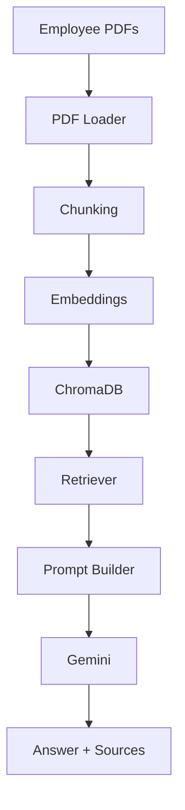

# 🤖 Employee Knowledge Assistant

An AI-powered Employee Knowledge Assistant built using Retrieval-Augmented Generation (RAG).

The application enables employees to ask natural language questions about HR policies and internal documentation. Instead of relying on the LLM's memory, it retrieves relevant policy documents from a vector database and generates grounded responses using Google Gemini.

---

## Features

- PDF document ingestion
- Recursive document chunking
- Sentence Transformer embeddings
- ChromaDB vector database
- Semantic document retrieval
- Google Gemini 2.5 Flash integration
- Source citations
- Streamlit web interface

---

## Architecture



---

## Tech Stack

- Python
- Streamlit
- ChromaDB
- Sentence Transformers
- Google Gemini
- LangChain
- PyPDF

---

## Screenshots

(Add screenshot here)

---

## Learning Outcomes

This project was built to understand how production Retrieval-Augmented Generation systems work.

Key concepts explored:

- Document ingestion
- Text chunking
- Embeddings
- Vector databases
- Semantic search
- Prompt engineering
- Grounded generation
- Source attribution

---

## Future Improvements

- GraphRAG
- Agentic RAG
- Hybrid Search
- Evaluation Dashboard
- Feedback Loop
- Metadata Filtering

---

## Run Locally

```bash
pip install -r requirements.txt

streamlit run app.py
```

---

## Author

Hrishikesh Ghadge

Product Manager exploring AI Product Management through hands-on projects.